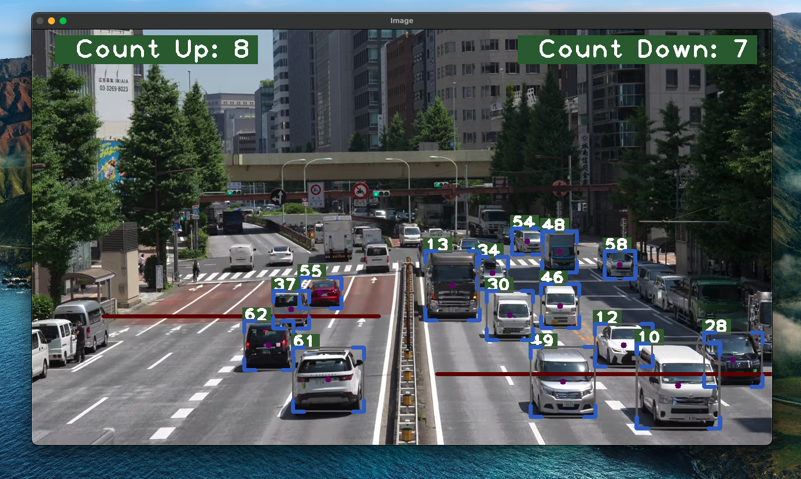

## Car Counter using  Python with YOLOv8



A Python project to count cars moving in both up and down directions using the YOLOv8 model.
 
## Features
- Real-time car detection and counting
- Separate counts for cars moving in different directions
- Visualization of detection and counting

## Installation
1. **Clone the repository**:
   ```bash
   git clone https://github.com/sachinthaWije/object-detection-car-counter.git
   cd car-counter


   
## This project uses the following third-party libraries:

- **[SORT: A Simple, Online and Realtime Tracker](https://github.com/abewley/sort)**
  - Copyright (C) 2016-2020 Alex Bewley alex@bewley.ai

